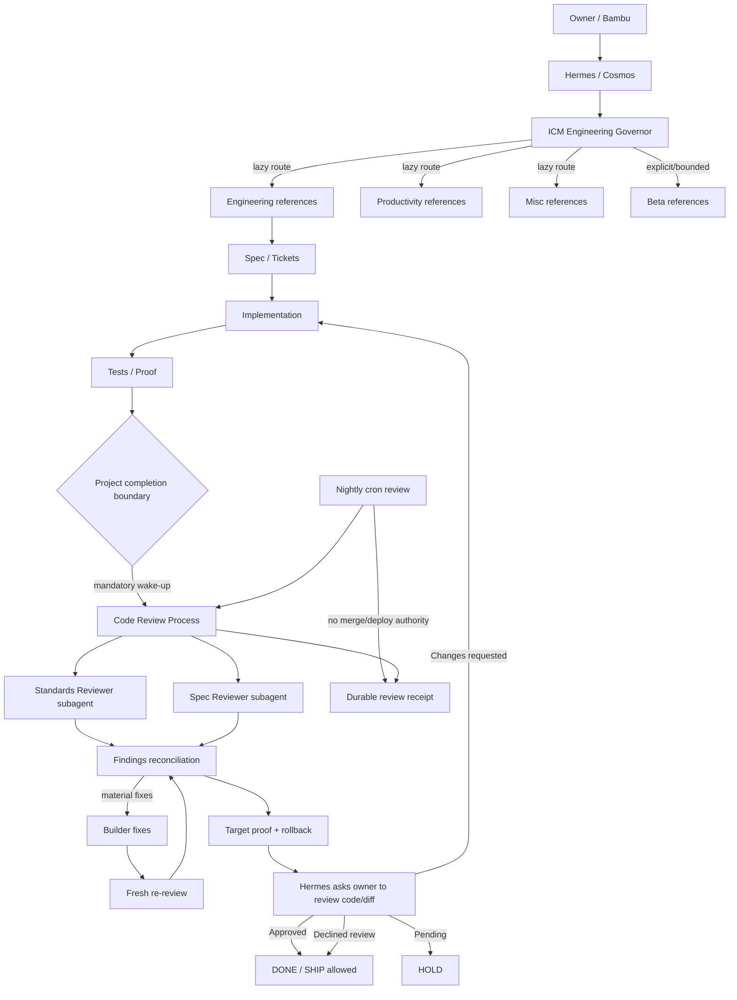

# ICM Engineering Governor Architecture

## Scaffold

```text
skills/
└── icm-engineering-governor/
    ├── SKILL.md
    ├── manifest.json
    ├── ATTRIBUTION.md
    ├── ARCHITECTURE.md
    ├── references/
    │   ├── engineering.md
    │   ├── productivity.md
    │   ├── misc.md
    │   └── beta.md
    └── workflows/
        └── code-review/
            └── PROCESS.md

cron/
└── icm-code-review.json

tests/
└── skills/
    ├── test_icm_engineering_governor.py
    └── test_icm_code_review_gate.py
```

## Runtime model



## Invariants

- Capability details remain lazy-loaded except the completion trigger.
- Completion review always wakes when a project reaches its closing boundary.
- The builder cannot be the final approver.
- Cron review may inspect, test, and dispatch reviewer subagents, but cannot merge or deploy.
- A human code-review prompt must be surfaced before project closure.
- Pending human review keeps the project on HOLD.
- Declining to inspect the diff does not waive automated proof or independent review.
